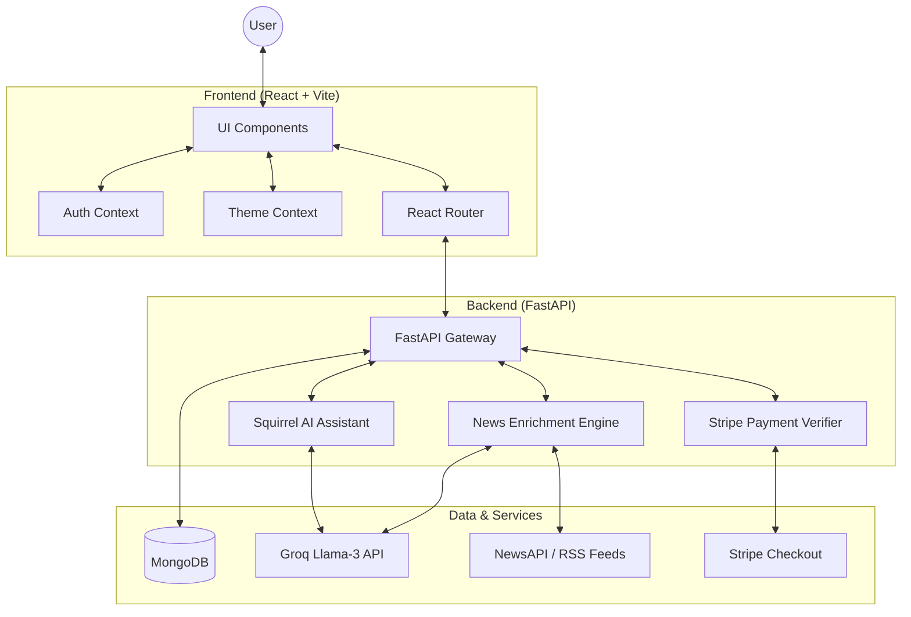
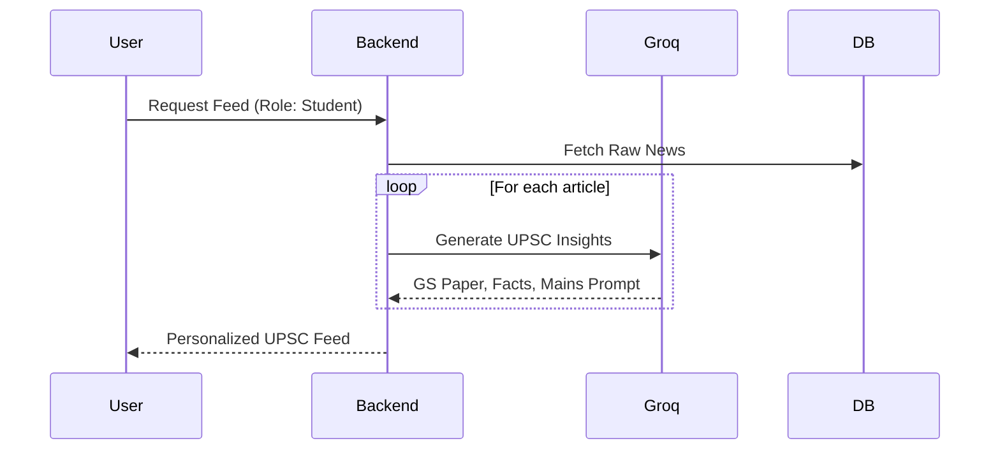
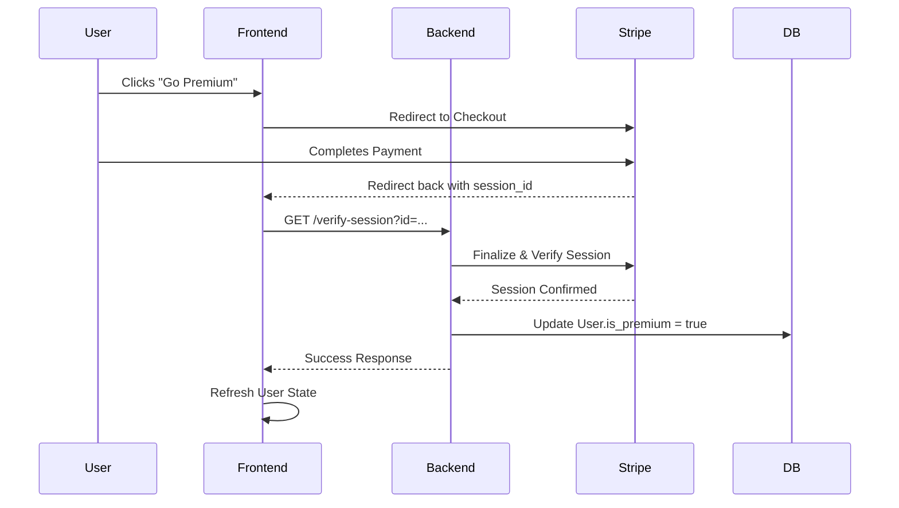

# 🐿️ News Navigator (Squirrel AI News)

 X  X 
---
### The Ultimate AI-Powered UPSC News Enrichment Hub

News Navigator x Squirrel is a high-performance, personalized news experience designed for aspirants, professionals, and curious minds. It leverages state-of-the-art LLMs (Groq / Llama-3) to transform raw news into actionable intelligence for competitive exams like UPSC.
Designed for UPSC aspirants and news enthusiasts, it provides curated briefings, AI-powered enrichment, to help users master current affairs.

---
## Contributors :
- Priya Singh   (GitHub: [link](https://github.com/priyasingh2709) )
- Anshuman Panda   (GitHub: [link](https://github.com/levi178u) )

---

## ⚖️ Features at a Glance
- [x] **GS Paper Mapping**: Real-time categorization of news.
- [x] **AI Quiz Hub**: Knowledge testing on daily events.
- [x] **Premium Assistant**: Context-aware companion with voice.
- [x] **Dark Mode**: Optimized for high-intensity study sessions.
- [x] **Direct Stripe Integration**: Frictionless upgrades.
      
---
## 🏛️ System Architecture



---

## 🗃️ Component Catalog

### 🎨 Frontend (UI/UX Layer)
- **`Feed.jsx`**: The heart of the app. Features dynamic news cards, "Smart Insights," and UPSC-specific prep sections.
- **`SquirrelChat.jsx`**: A floating AI companion with a custom squirrel character (`sq1.png`, `sq2.png`). Supports context-aware chat and TTS (Text-to-Speech).
- **`QuizModel.jsx`**: Real-time evaluation. Generates interactive quizzes based on the latest news to test your retention.
- **`Landing.jsx`**: A premium, glassmorphic landing page designed to "Wow" users and convert them to Pro members.
- **`ThemeContext.jsx`**: A robust dark-mode engine with vibrant accent colors (Orange, Primary Blue).
- **`AuthContext.jsx`**: Handles JWT persistence, login, and real-time subscription status syncing.

### ⚙️ Backend (Logic Layer)
- **`news.py`**: Handles news aggregation and the **UPSC Enrichment Engine** (GS Paper mapping, Prelims facts, Mains prompts).
- **`assistant.py`**: Orchestrates the Squirrel AI chat experience using high-speed reasoning from Groq.
- **`payment.py`**: Securely verifies Stripe sessions and automatically upgrades accounts without page refreshes.
- **`auth.py`**: Comprehensive user management with Bcrypt password hashing and JWT issuance.
- **`db.py`**: prisma client db for user entries and credentials
- **`feed.py`**: feed engine for live telecasts, feeds and essential engine features
- **`vector_db.py`**: faiss for indexing and context learning

### 📊 Data Layer
- **MongoDB/PostgresSQL**: Used for storing user profiles, roles (Aspirant/Professional), subscription status, and news cache.
- **Groq (Llama-3-70b)**: Powers all intelligence, from summarizing news to generating GS-relevant prompts.
- **Stripe**: Handles the full payment lifecycle from checkout to verification.

---

## ✨ Features

- **Personalized Feed**: Content tailored to your role (Student, Professional, etc.).
- **UPSC Deep Prep**: Mapping news to GS Papers, Prelims facts, and Mains answers.
- **Interactive Squirrel**: Your AI companion for explaining news and taking quizzes.
- **Premium Perks**: Unlock advanced AI tools and UPSC-specific analytics via Stripe.
- **Dark Mode**: Sleek, eye-friendly design for late-night study sessions.
- **TTS and Audio Postcasts**: Provides with best in Text-to-Speech, audio briefing and Postcasts

---

## 🔄 Core Workflows


### 🎓 UPSC Enrichment Workflow
1. **Fetch**: Backend pulls raw news from NewsAPI/RSS.
2. **Analyze**: AI identifies key entities and maps them to General Studies (GS) Papers.
3. **Generate**: AI extracts "Prelims Facts" and creates a "Mains Answer Prompt."
4. **Personalize**: The feed scales the tone based on the user's role (defaults to UPSC Aspirant).

### 💳 Premium Subscription & Verification
1. User clicks **"Go Premium"**.
2. Frontend redirects to **Stripe Checkout**.
3. Upon success, Stripe redirects back with a `session_id`.
4. Frontend calls `/api/payment/verify-session`.
5. Backend verifies with Stripe API and updates the DB in real-time.
6. Frontend updates using `refreshUser()` via `AuthContext`.

---

## 🛠️ Tech Stack & Setup

- **Core**: HTML5, Semantic CSS, JavaScript (ES6+).
- **Frameworks**: React, FastAPI (Python), TailwindCSS.
- **Database**: MongoDB (Async Motor driver) & PostGreSQL Prisma CLI client.
- **Styling**: Tailwind CSS with modern tokens (Glassmorphism, Dark Mode) and UI elements.
- **AI**: Groq (Inference Engine).
- **Vector_DB**: FAISS DB
- **AI Feats**: Sentence Transformers and LLMA model of Groq AI
- **TTS**: HuggingFace Models and ElevenLabs
- **Payment**: Stripe.
- **Auth**: JWT
- **Testing**: CLI testing and PyTest

## 🚀 Getting Started

### Prerequisites
- Python 3.9+
- Node.js 18+
- MongoDB instance (local or Atlas)
- PostGresSQL or Prisma CLI client

### Local Setup

1. **Clone the repository**
   ```bash
   git clone https://github.com/levi178u/ET-Hackathon.git
   cd ET-Hackathon
   ```

2. **Environment Variables**
   Create `.env` in `backend/` and `frontend/`:
   ```env
   # Backend .env
   DATABASE_URL=your_mongo_url/ postgres_url
   GROQ_API_KEY=your_groq_key (or) OPENAI_API_KEY=your_openai_key
   STRIPE_SECRET_KEY=your_stripe_key
   STRIPE_PUBLISHABLE_KEY=your_stripe_pub_key
   NEWSAPI_KEY=your_newsapi_key
   RAPIDAPI_KEY=your_rapidapi_key_here
   JWT_SECRET=your_auth_key
   ```

3. **Running the App**
   Use our automated deployment script:
   ```powershell
   ./scripts/deploy.ps1
   ```

---

## 🧩 Project Structure
```text
ET-Hackathon/
├── backend/            # FastAPI Project
│   ├── api/            # Route Handlers (Auth, News, Assistant, Payment)
│   ├── models/         # Pydantic Schemas
│   └── main.py         # Entry Point
├── frontend/           # React + Vite Project
│   ├── src/
│   │   ├── components/ # Reusable UI (SquirrelChat, Quiz, Navbar)
│   │   ├── context/    # Global State (Auth, Theme)
│   │   └── pages/      # Views (Feed, Landing, Dashboard)
│   └── public/         # Static Assets (sq1.png, sq2.png)
└── scripts/            # Automation (Deploy, Setup)
```

---

## 🔄 Workflows

### 1. UPSC Enrichment Flow


### 2. Premium Subscription Verification


---
